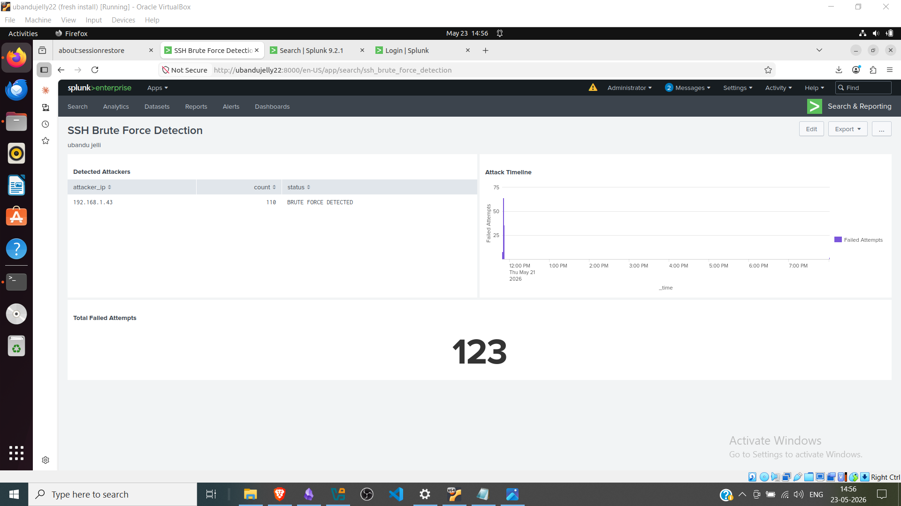

# Splunk SIEM: SSH Brute Force Detection

**A practical detection engineering project demonstrating log analysis and threat identification using Splunk SPL.**

---

## Overview

This project shows how a SOC analyst uses Splunk to detect and investigate SSH brute force attacks in real-time. It demonstrates:
- **Log ingestion** from Linux systems into a SIEM
- **Detection rule creation** using Splunk Processing Language (SPL)
- **Alert configuration** for automated threat response
- **Dashboard visualization** for incident investigation

**Real Lab Attack:** 110+ failed SSH login attempts from a single attacker IP, detected and visualized in under 3 minutes.

---

## Lab Setup

| Component | Details |
|-----------|---------|
| **Attacker** | Kali Linux (192.168.1.43) |
| **Target** | Ubuntu 22.04 (192.168.1.42) |
| **SIEM** | Splunk Enterprise 9.2.1 |
| **Attack Tool** | Hydra v9.6 |
| **Log Source** | `/var/log/auth.log` |
| **Sourcetype** | `linux_secure` |

**Attack Command:**
```bash
hydra -l root -P rockyou.txt -t 4 ssh://192.168.1.42
```

**Result:** 110 failed login attempts, 0 successful breaches (attack stopped after detection).

---

## Detection Queries

### Query 1: Basic Event Search
**Purpose:** Verify SSH logs are ingested into Splunk correctly.

```spl
index=main sourcetype=linux_secure "Failed password"
```

**Output:** 123 events found  
**Use Case:** Baseline verification before building detection logic

---

### Query 2: Identify Attacker IP
**Purpose:** Extract source IP and count failed attempts per IP.

```spl
index=main sourcetype=linux_secure "Failed password"
| rex "from (?P<attacker_ip>\d+\.\d+\.\d+\.\d+)"
| stats count by attacker_ip
| sort -count
```

**Output:**
```
attacker_ip       count
192.168.1.43      110
127.0.0.1         5
```

**Key Technique:** Used `rex` (regex extraction) because `linux_secure` sourcetype didn't auto-extract source IP. This is common in real SOCs—always verify field extraction before building alerts.

**Regex Breakdown:**
- `from` → literal text before IP in auth.log
- `(?P<attacker_ip>...)` → named capture group
- `\d+\.\d+\.\d+\.\d+` → matches IPv4 address pattern

---

### Query 3: Threshold Detection (Alert Base Query)
**Purpose:** Flag IPs exceeding 10 failed attempts as brute force.

```spl
index=main sourcetype=linux_secure "Failed password"
| rex "from (?P<attacker_ip>\d+\.\d+\.\d+\.\d+)"
| stats count by attacker_ip
| where count > 10
| eval status="BRUTE FORCE DETECTED"
| table attacker_ip, count, status
```

**Output:**
```
attacker_ip       count    status
192.168.1.43      110      BRUTE FORCE DETECTED
```

**What This Does:**
1. Finds all failed SSH logins
2. Extracts attacker IP using regex
3. Counts attempts per IP
4. **Filters threshold:** Only IPs with >10 attempts
5. Labels as "BRUTE FORCE DETECTED"

**This is the query that triggers the alert.**

---

## Alert Configuration

**Alert Details:**
- **Name:** SSH Brute Force Detected
- **Type:** Scheduled search
- **Frequency:** Every hour
- **Trigger:** Number of results > 0
- **Severity:** Medium
- **Action:** Add to Triggered Alerts

**Logic:** If any IP exceeds 10 failed SSH logins in the indexed data, fire an alert.

### False Positive Mitigation

**Common False Positives:**
- Automated SSH monitoring scripts
- Misconfigured backup jobs
- Admin running repeated SSH tests from known IP

**How to Handle:**
1. **Whitelist admin IPs** — exclude known safe IPs
2. **Raise threshold** — change `where count > 10` to `where count > 20` in noisy environments
3. **Add time window** — detect 10+ failures **within 60 seconds** (more suspicious than spread over hours)

**Example with time window:**
```spl
index=main sourcetype=linux_secure "Failed password"
| rex "from (?P<attacker_ip>\d+\.\d+\.\d+\.\d+)"
| stats count, earliest as first_attempt, latest as last_attempt by attacker_ip
| eval attack_duration = last_attempt - first_attempt
| where count > 10 AND attack_duration < 60
| eval status="RAPID BRUTE FORCE"
```

---

## Dashboard

The dashboard displays 3 panels:

### Panel 1: Detected Attackers (Table)
Shows all IPs with >10 failed attempts.

**Screenshot:**


---

### Panel 2: Attack Timeline (Column Chart)
Shows failed attempts per minute over time.

**Screenshot:**


**Key Insight:** Peak of 64 attempts/minute confirms tool-driven attack. Humans cannot attempt 64 logins/minute—this is Hydra at full speed (4 threads, 16 passwords/thread).

---

### Panel 3: Total Failed Attempts (Single Value)
Shows cumulative count of all failed logins.

**Screenshot:**


---

## How SOC Uses This

1. **Monitor:** Alert fires hourly if brute force detected
2. **Investigate:** Click into dashboard to see attacker IP and timeline
3. **Respond:** 
   - Block IP at firewall
   - Check for successful logins (Query 4 below)
   - Review user account for unauthorized changes
4. **Document:** Log incident and block rule in change management

---

## Additional Queries for Investigation

### Query 4: Check for Successful Logins from Attacker IP
```spl
index=main sourcetype=linux_secure "Accepted password" attacker_ip="192.168.1.43"
```

**If results > 0:** Attacker gained access → **CRITICAL**  
**If results = 0:** Attack blocked → **INFO**

### Query 5: Timeline of Attack (Detailed)
```spl
index=main sourcetype=linux_secure "Failed password"
| rex "from (?P<attacker_ip>\d+\.\d+\.\d+\.\d+)"
| where attacker_ip="192.168.1.43"
| timechart span=1m count as "Failed Attempts"
```

---

## SPL Commands Reference

| Command | Purpose |
|---------|---------|
| `index=` | Specify Splunk index to search |
| `sourcetype=` | Specify log format/parsing rules |
| `rex` | Extract fields using regex |
| `stats` | Aggregate and count events |
| `where` | Filter results by condition |
| `eval` | Create calculated fields |
| `table` | Display specific columns |
| `sort` | Order results (- = descending) |
| `timechart` | Time-based aggregation for charts |
| `match()` | Regex match function in where clause |

---

## Files Included

```
splunk-siem-ssh-detection/
├── README.md                          # This file
├── queries/
│   ├── query1_basic_search.spl
│   ├── query2_attacker_ip.spl
│   ├── query3_threshold_detection.spl
│   └── query4_successful_logins.spl
├── screenshots/
│   ├── 01_splunk_login.png
│   ├── 02_data_ingested.png
│   ├── 03_query1_attackers.png
│   ├── 04_query2_threshold.png
│   ├── 05_query3_timeline.png
│   ├── 06_dashboard.png
│   └── 07_alert_configured.png
└── auth.log                           # Sample log file (optional)
```

---

## Key Takeaways

 **Detection Logic:** Threshold-based (10+ failures = alert)  
 **Real Lab Proof:** Screenshots show actual Splunk execution  
 **Regex Skills:** Manual field extraction using `rex`  
 **Alert Design:** Scheduled search with severity and actions  
 **Investigation Ready:** Dashboard panels for quick triage  

---

## Interview Talking Points

**"Walk me through your Splunk project."**

> This project demonstrates how I use SPL to detect brute force attacks. I started with a basic search to verify log ingestion, then built a regex-based query to extract attacker IPs, and finally created a threshold detection rule that triggers an alert when any IP exceeds 10 failed attempts. The dashboard shows the timeline of the attack—64 attempts per minute—which confirms it's tool-driven, not a human attacker. I also documented false positive scenarios and mitigation strategies, like whitelisting known admin IPs and adding time-window logic.

---

## Technologies

- **SIEM:** Splunk Enterprise 9.2.1
- **Language:** Splunk Processing Language (SPL)
- **Log Format:** Linux syslog (auth.log)
- **Lab OS:** Ubuntu 22.04, Kali Linux
- **Attack Tool:** Hydra v9.6

---

## Author

**Boney Cyriac**  
IT Security Engineer | SOC Analyst  
[GitHub](https://github.com/Boney-cyriac-ITsecurity) | [LinkedIn](https://linkedin.com/in/boney-cyriac)

---

## Last Updated

May 23, 2026

---

**Next Step:** Once SOC L1 interview confirms understanding of detection logic, advance to **detection engineering** with Sigma rules and MITRE ATT&CK framework mapping.
